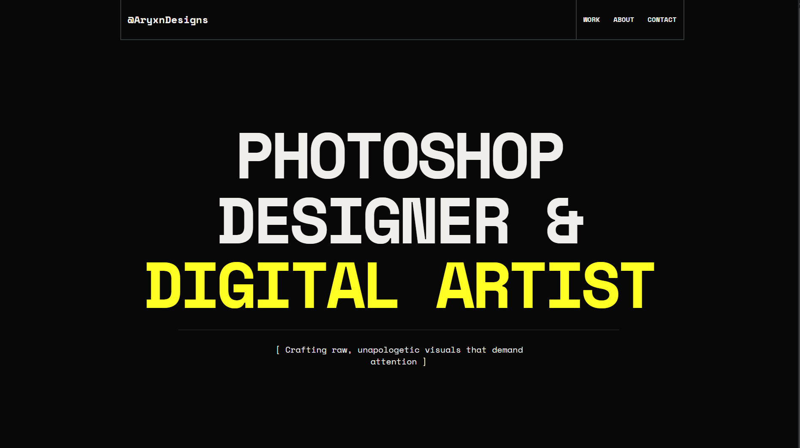

# 🎨 Aryan's Design Portfolio

> A vibrant and dynamic portfolio showcasing the creativity, design, and development skills of Aryan Srivastava. Built with ❤️ using **Next.js**, **Tailwind CSS**, and deployed on **Netlify**.

---

## 🌐 Live Preview

🔗 [Visit the Website](https://aryxndesigns.in)

---

## 🚀 Features

- 🖼️ Interactive design cards with image previews
- 🛍️ **NEW:** Shop where users can **purchase designs** in **A3** or **A4** sizes
- 💳 Seamless and **secure payment** with **Razorpay integration**
- 🔍 Hover-based animations and transitions
- 📱 Responsive layout for all screen sizes
- 🧠 AI Hint tags and design categories
- 🔗 Download and Instagram links for each project
- 🧑‍💻 Smooth user experience with Next.js SSR

---

## 🛠️ Tech Stack

| Technology       | Description                             |
|------------------|-----------------------------------------|
| **Next.js**      | React-based framework for SSR           |
| **Tailwind CSS** | Utility-first CSS for rapid styling     |
| **TypeScript**   | Type-safe JavaScript                    |
| **Netlify**      | Hosting and continuous deployment       |
| **Razorpay**     | Secure and reliable payment gateway     |

---

## 🛍️ Shop Highlights

- 🖨️ Choose between **A3** and **A4** size formats for each design  
- 🔐 Integrated with **Razorpay** for fast, secure checkout  
- 📦 More prints & downloadable content coming soon!

---

## 🤝 Contributing

If you’d like to contribute or suggest features, feel free to:

- ⭐ Star this repo
- 🐛 Open an issue
- 🔀 Submit a pull request

---

## 📸 Credits

All designs are original and created by **Aryan Srivastava**.  
Please do not reproduce or redistribute without permission.

---

## 📬 Connect with Me

- 📸 [Instagram](https://www.instagram.com/aryxndesigns)
- 🧑‍💼 [LinkedIn](https://www.linkedin.com/in/aryan-srivastava-35112a247/)
- 🖥️ [Website](https://aryxndesigns.in)

---

> “Design is not just what it looks like and feels like. Design is how it works.” – *Steve Jobs*

